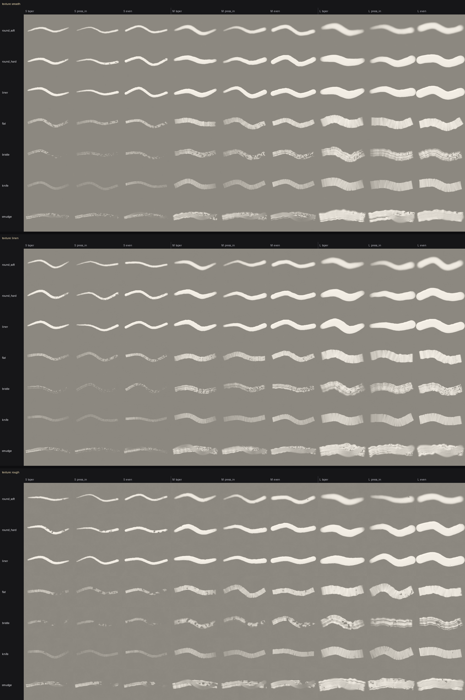

# Easel

A headless painting engine for agents that can look at their own work.

Not a drawing library and not a rasteriser. Brushes carry a finite load of paint and
run out along a stroke. Paint lands wet and mixes with what is already there, in a
pigment model where blue and yellow make green rather than grey. The canvas has
tooth, and a brush low on paint catches only the high points — so dry brush is not a
special effect, it is what happens when you run out of paint on rough canvas.

There are no layers, and no undo that costs nothing. You work in passes, and when
something is wrong you paint over it.

```python
from easel import Session

s = Session(1024, 768, texture="linen", ground="toned_grey", seed=7)
s.palette["shadow"] = s.palette.mix("ultramarine", "burnt_umber", 0.4)

s.block_in("lower-half", brush="bristle", color="shadow", density=0.8)
s.look(values=True)                       # check the value structure
s.stroke([(0.2, 0.6), (0.6, 0.55), (0.9, 0.62)], "bristle", "yellow_ochre")
s.export("painting.png")
```



*Every brush, size and pressure profile, on each canvas texture. Regenerate with
`python scripts/make_brush_sampler.py` — this sheet is the project's primary test
artefact, and looking at it catches what the test suite cannot.*

## Install

Requires Python 3.12 or newer. Only numpy and Pillow — nothing that is painful to
build on Windows.

```bash
pip install -e .
```

That installs an `easel` command. Pip puts it in the interpreter's scripts
directory, which is often not on `PATH` (it warns when it is not), so
`python -m easel ...` is always available as the same command by another name.

## If you are an LLM agent, read PAINTER.md

[`PAINTER.md`](PAINTER.md) is the guide written for you. It teaches the *workflow* —
tone the ground, establish big value shapes, check values, refine, edges, highlights
last — rather than listing functions. The engine is designed around one habit:

> Look every five to fifteen strokes. A stroke you did not look at was a guess.

## What is in the box

| Piece | What it does |
|---|---|
| `Session` | The one object you hold. Canvas, palette, seed, history, `look()`. |
| `Canvas` | Linear-light RGB plus `wetness`, `thickness`, `sketch` (graphite) and canvas `height` (tooth). |
| Brushes | `round_soft`, `round_hard`, `liner`, `flat`, `bristle`, `knife`, `smudge`. Procedural tips. |
| `Palette` | A limited pigment set with no black. Mix, tint, shade, and name your mixes. |
| Regions | `region("top-left")`, `cell("D6")`, `horizon(0.4)`, `below(...)`, `between(...)`. |
| `look()` | Grid overlay, greyscale values, region crop, side-by-side, diff, landmarks, and a fine grid of labelled tenths inside a crop. |
| Drawing | `pencil()` lays graphite under the paint, which covers it in proportion to what actually lands. Not counted as a stroke. |
| Planning | `preview()` shows where a mark would go over both panels; `rehearse()` paints it on a copy and shows what it would look like. Neither touches the canvas. |
| Measuring | `compare(reference)` gives the per-cell value of both and the difference, as a table and a heat map. `prepare(reference)` cuts the photograph into numbered masses. |
| History | Every stroke logged as data. Undo, replay, GIF time-lapse, contact sheet. |

Coordinates are always normalised `0.0–1.0` with the origin top-left. Raw pixels are
never exposed, because absolute pixel coordinates are exactly what a language model
is worst at.

## Command line

Session state lives in a single `.easel` file, so you can work in increments from a
shell without holding a Python process open.

```bash
easel new painting.easel --size 1024x768 --texture linen --ground toned_grey --seed 7
easel run painting.easel first_pass.py
easel look painting.easel --grid
easel look painting.easel --values
easel look painting.easel --region D4 --fine --reference ref.jpg
easel mark painting.easel rim_l 0.335 0.315
easel compare painting.easel ref.jpg
easel prepare painting.easel ref.jpg --level coarse
easel undo painting.easel 3
easel export painting.easel painting.png
easel timelapse painting.easel painting.gif
easel brushes
```

Every one of these also works as `python -m easel ...`, for when the `easel`
executable is not on `PATH`.

A script run by `easel run` gets the session pre-bound as `s`, with the whole public
API already in scope — it needs no imports.

## Determinism

Every session takes a seed, and the same script with the same seed produces the same
PNG. Each stroke draws its randomness from a generator derived from
`(seed, stroke index)` rather than from one running stream, so a stroke's jitter
depends only on which stroke it is — not on how much randomness earlier calls
happened to consume.

That is what makes replay exact:

```python
s.replay()          # rebuilds the whole painting from its log; identical export
s.replay(upto=40)   # the state after the first 40 records
```

It is also how `easel undo` works across separate shell invocations: session files
carry the log, not undo snapshots.

Golden-image tests hold this honest. `tests/golden/` stores a hash and a PNG for a
fixed script of marks on each texture, plus the whole brush sampler; a change to
what a mark looks like fails the suite, and the failure hands you both images to
compare. They caught a real one on their first run — see `REVIEW.md` finding 19.

## Design notes

A few decisions worth knowing about, because they are the ones that make output look
painted rather than generated:

- **Pigment mixing, not RGB averaging.** Colours combine in Kubelka-Munk K/S space
  using a power mean (`p = 0.5`). Plain RGB averaging turns every mixture
  grey-brown; a hard reflectance floor is also needed, or a channel-zero colour
  swamps the mix and red + blue comes out green. See `src/easel/color.py`.
- **Spacing is measured along travel.** A flat or knife tip is thin in the direction
  it moves. Spacing it like a round tip leaves a picket fence of discrete bars.
- **Wobble is smoothed, not per-dab.** Independent per-dab jitter makes neighbouring
  dabs clump and gap, which reads as banding at the dab frequency. A slow wander
  along the stroke gives the uneven edge of a real brush without the ripple.
- **The tooth gate is roughened with aperiodic grain.** Gating a near-periodic weave
  with a smooth threshold produces a halftone dot screen as paint runs out, which
  reads as print rather than as dry brush.
- **The bristle comb is drawn per stroke, and a bristle has a width of its own.**
  One fixed comb per brush means every wide mark prints the same streaks and a mass
  laid in passes comes out as corduroy; a fixed *count* across the tip means the
  streaks scale with the brush, so a big mass prints stripes wider than anything in
  the picture and a small mark carries the brush's signature instead of the
  feature's. So spacing, phase and the missing bristles are redrawn each stroke, and
  the count follows the brush's size.
- **Width follows pressure on the round tips.** Pressure that changes only how much
  paint lands is invisible once an opaque colour saturates, and it means a mark that
  tapers — a lid, a brow, a lash, a twig — is two strokes at two sizes. The oriented
  tips keep their chisel, because a `flat` brush's width is the mass it lays.

## Status

Early. The engine, palette, composition helpers, `look()`, history, CLI and the
precision tools (drawing, landmarks, preview, rehearse, compare, prepare) are
working; see [`NOTES.md`](NOTES.md) for what is done, what is stubbed, and what is
next. An MCP server is deliberately last.

## Licence

MIT — see [`LICENSE`](LICENSE).

The optional [Mixbox](https://github.com/scrtwpns/mixbox) pigment model gives better
mixing than the built-in one, but its reference implementation is CC BY-NC. It is
therefore an opt-in extra (`pip install -e ".[mixbox]"`), not a dependency — check
that its licence suits your use before enabling it.
