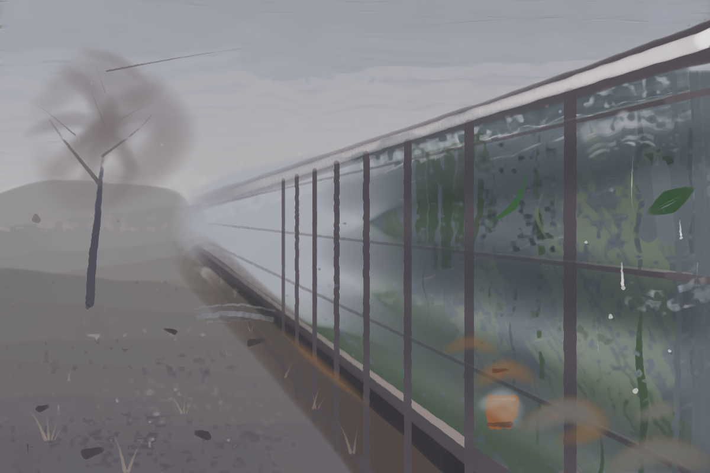

# Fogged glass — a greenhouse wall in late winter

**To understand this, start by reading `prelude.py` (the projection and the palette),
then `p0_draw.py` (the drawing), then the passes `p1_sky.py` → `p20_puddle.py` in
number order.** Every pass is re-runnable — `python -m easel run painting.easel pN_*.py`
— and `prelude.py` runs first in the same scope, so the projection and the named
mixtures are already defined inside every pass.

## The subject

Standing outside a greenhouse on a flat grey afternoon in late winter. The glass is
fogged from the inside; water has run down it in tracks that clear the film, and
through those tracks the green comes part of the way through. One leaf is pressed flat
against the pane. One terracotta pot glows on the bench. Outside: frozen ground, a bare
tree, no sun and no shadows.

The idea was **warmth you can see and not quite reach**. Almost the whole picture is
one surface, and it has to read as three depths at once: the water on the near side,
the plants behind it, the winter beyond.

## The decisions that mattered

**The projection came before any drawing.** The scene is built of straight edges that
converge, so `P(xm, hm, dm)` in `prelude.py` places everything in metres and says where
it lands. Eye at 1.70 m, vanishing point left of centre on the horizon. This did the
most important thing for free: a frontal wall of glass would have been a layer cake,
and the same wall seen down its own length is a fan of lines converging on one point,
crossing every band. It also priced the members honestly — a glazing bar is
`0.8 × 0.045 / dm` wide, so the pressure list on a round tip thins each one exactly as
distance thins it.

**The strong green was held back.** The foliage inside is laid muted (chroma ~0.026),
and the saturated green is spent only where the film is cleared — the runnels, and the
one pressed leaf. This inverted the first plan and made a better picture: the green is
concentrated in narrow vertical tracks, which *is* the subject.

**The film is glazes, not a mass.** Laid as paint it buried the glass twice. A glaze
shifts what is under it without hiding it, and `glaze(..., to_value=)` solves for the
opacity that lands a passage on a value.

**The warm ground was chosen to be seen through.** `umber_wash` (0.425, warm) under a
cool film, so anything left showing would read as warmth coming through. It mostly did
not survive — see the faults.

## Value plan, and what it measured at the end

| | planned | measured in place |
|---|---|---|
| roof glass lip — the lightest thing | 0.86 mixed | 0.689 |
| sky, zenith | 0.61 | 0.625 |
| near pane | 0.44 | 0.387 |
| near yard | 0.38 | 0.395 |
| glazing bar | 0.31 | 0.299 |
| brick base — the darkest | 0.29 | 0.261 |

The lightest mass is the one planned to be lightest. Range 0.26–0.69: deliberately
low-key, which the subject wants.

## Pitfalls hit, in order

Every one of these was caught in a **rehearsal**, which commits nothing. That is the
whole reason the budget survived — most passes here were rehearsed two to five times
before a single stroke was paid for.

1. **A blue summer sky.** Value measured right, read far too light and too coloured
   against the warm ground. Remixed to near-neutral pearl (chroma 0.012).
2. **A rectangle in the background.** Scumbled the yard into `Region(...)` boxes and
   got a hard vertical edge down the middle of the picture. The fix was to run the
   ground the full width below the horizon and let the greenhouse bury the middle,
   which is what back-to-front is for.
3. **Comb, then terrace, then neither.** The ground field came out striated with a
   `bristle` (its comb printed 15× across the full width), then blocky with a `flat`
   (chisel ends stacking). `round_hard` at `pressure="even"` fixed it: a round tip
   declares no axis, so it cannot print the canvas's grain into a mass.
4. **A pine forest.** `direction=("axis", 70)` on the glass wedge crossed the passes
   into a vertical comb, and at `size=0.105` the brush's overhang ate the eave line.
5. **The chisel staircase**, textbook, where banded passes ended on the band joins.
   Dropped the banding entirely — the fog laid on top carries the gradation.
6. **Spring grass.** The foliage first went down at full chroma and read as a lawn
   painted on the *outside* of the building.
7. **A lit doorway.** The far-end haze laid as a filled shape came back as a pale panel
   with a hard edge down the glass. Relaid as strokes that lose their near end — the
   same lesson as a cast shadow.
8. **Four light beams.** Four tapering haze strokes radiating from the vanishing point
   read as searchlights. Three wider ones merged into one haze.
9. **`jitter=0.5`.** Read "halving both halves the wander" and passed `0.5`; the default
   is `0.02`, so this was 25× it, and every member of the frame came back as a chain of
   separate beads. Halved is `jitter=0.01, size_jitter=0.03`.
10. **A balustrade.** The bars alone read as a railing. The horizontal **pane laps** are
    what say *glazing*, and they cross the comb the bars make.
11. **A cauliflower.** The pressed leaf, laid as a `hull` filled with a round tip,
    printed the tool's own outline. Relaid as two tapering strokes that meet, plus a
    midrib — marks that have a direction.
12. **`cover()` leaves a panel.** Burying the cauliflower with `cover(Region(...))` put
    a pale rectangle across the pane, because its ends run outside the area by design.
    Buried it instead with marks shaped like the pane.
13. **A pale strip down the right frame.** `GLASS.inset(0.024)` pulled the glass off the
    canvas edge. A mass that meets the frame should run off it.
14. **A feather duster.** Seven crown glazes all radiating from the trunk drew a daisy.
    Scattered their origins so they cross instead.
15. **A sunset stripe.** The warm glazes laid the length of the bench came back as three
    orange bands. Warmth has to *pool* where the pots are.
16. **Lens flare.** Those pools then read as four similar orange ovals. One became a pot
    with a pot's form; the other three were glazed back into the mist.

## Faults I did not fix

- **The ground does not show through anywhere.** The checklist asks for it and it is not
  there: chroma inside the glass measures 0.007–0.011 against the ground's warm ~0.03,
  so `umber_wash` is buried. Laying the interior at `density=1.0, load=1.0` bought a
  solid support for the fine marks and spent the ground to get it. Next time: leave two
  or three deliberate holes low in the glass where the warm ground stays.
- **The near pane (0.387) and the near yard (0.395) are 0.008 apart.** They do not
  touch, so it reads — but the picture's two largest areas sit at one value, and the
  whole thing is low-key partly as a result.
- **The tree crown is amorphous** under a close crop, and its fine branches read as
  spokes from the fork. At full size it passes; at a 3×6-cell crop it does not.
- The glazing grid is regular by nature. It is broken only by the one clearer pane, the
  varying bar weights, and the runnels crossing it.

## The numbers

- **311 of 320 strokes.** Subject share **29%** (88 marks noted `subject`), down from
  100% during the runnel passes as the last third went on the surroundings — the tree,
  the frozen ground, the weeds at the foot of the base, the puddle.
- Split: glass 69, subject 88, distance 41, ground 26, frame 22, sky 18, fog 9.
- Signature: 2 marks, free, carrying `note="signature"`.

## The signature

Not a name — I do not have one. The whole painting is made of one gesture repeated: a
line that runs downward and loses itself, in the runnels, the drips, the dead grass, the
branches. So the mark is that gesture made once, alone, in the bottom-left corner, on
ground where no water is running: a short vertical taper with a small tick across it, at
value 0.28 against ground at ~0.36 — close enough that you find it only if you look.

## File map

| file | what it is |
|---|---|
| `prelude.py` | the projection `P()`, the greenhouse in metres, the named mixtures, and the masses (`GLASS`, `BASE`, `SKY`, `YARD`, `RUNNELS`, the tree) |
| `p0_draw.py` | the whole arrangement in graphite — free, and redrawn twice |
| `p1_sky.py`, `p2_yard.py` | the distance: overcast sky, hedge, frozen ground, frost |
| `p3_interior.py`, `p4_plants.py`, `p5_fog.py` | inside the glass, the foliage, then the condensation film |
| `p6_frame.py` | brick base, rail, glazing bars, pane laps, eave, roof lip |
| `p7_runnels.py`, `p8_wet.py` | the runnels, the beading, the pressed leaf |
| `p9_repair.py` | two repairs: the right frame edge, and the cauliflower |
| `p10_tree.py`, `p14_tree2.py` | the tree, and then breaking its oval silhouette |
| `p11_pane.py`, `p12_ground.py`, `p13_drops.py` | settling the near pane; the foreground; droplets and meniscus light |
| `p15_warmth.py`, `p16_pots.py` | the warm note, and making one of them a pot |
| `p17_last.py`, `p20_puddle.py` | the foot of the building; the frozen puddle |
| `p18_sign.py`, `p19_export.py` | signature and export |
| `ex/` | the nine exercises from `PAINTER.md`, painted before starting |
| `scratch/` | throwaway probes — swatch strips, value samples, stroke tallies — and `p9_leaf_fix.py`, a first attempt at the leaf repair that `p9_repair.py` superseded; it is not part of the sequence and running it would apply the repair twice |
| `painting.png`, `painting.gif`, `sheet.png` | the picture, the time-lapse, the contact sheet |
